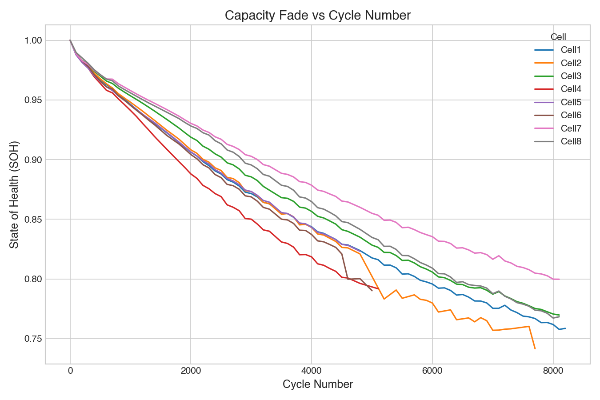
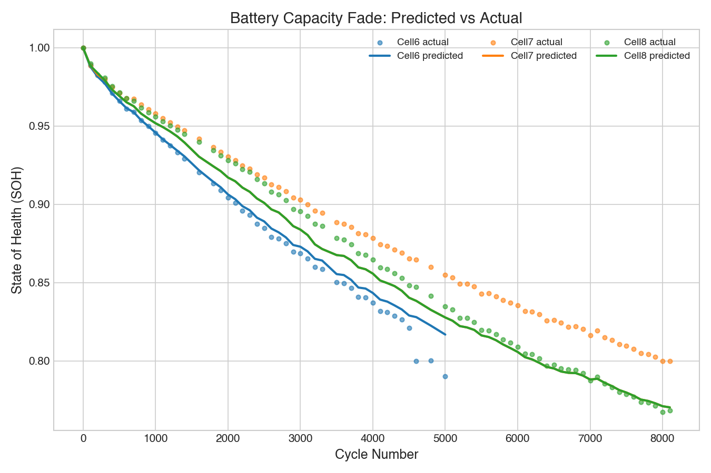

# Lithium-ion Battery Capacity Fade Analysis and Prediction

Analysis and machine-learning prediction of capacity fade in lithium-ion cells, using the [Oxford Battery Degradation Dataset 1](https://ora.ox.ac.uk/objects/uuid:03ba4b01-cfed-46d3-9b1a-7d4a7bdf6fac). The project parses the raw MATLAB cycling data, tracks State of Health (SOH) across cycles, removes measurement artefacts, and builds regression models that predict SOH from cycle number and an early-life degradation feature.

## Dataset

Oxford Battery Degradation Dataset 1 (Howey & Birkl, University of Oxford, 2017). Eight Kokam SLPB533459H4 740 mAh pouch cells cycled at 40 degrees C under a CC-CV charge and an urban Artemis drive-cycle discharge, with characterisation tests every 100 cycles.

The data file is not included in this repository because of its size (about 262 MB). To reproduce:

1. Download `Oxford_Battery_Degradation_Dataset_1.mat` from the [ORA record](https://ora.ox.ac.uk/objects/uuid:03ba4b01-cfed-46d3-9b1a-7d4a7bdf6fac).
2. Rename it to `OxfordBatteryData.mat` and place it in the `code/` folder.

## Method

**Parsing.** The raw `.mat` is a four-level nested MATLAB struct (cell to cycle group to segment to time series). For each characterisation point, discharge capacity is taken as the maximum accumulated charge during the 1C discharge segment (`C1dc`). This produces a tidy table of `Cell`, `Cycle`, and `Capacity_Fade`.

**State of Health.** SOH is defined as capacity relative to the cell's own first characterisation point, so every cell starts at 1.0 and the comparison reflects degradation rate rather than manufacturing spread in initial capacity.

**Outlier removal.** Capacity fade should be monotonic, since a cell cannot physically regain capacity. Measurements that increase relative to the previous point, or that drop far faster than normal degradation, are flagged as measurement artefacts. Using the per-step percentage change within each cell, a point is removed if it rises by more than 0.5 percent or falls by more than 5 percent (normal fade is roughly 0.4 percent per 100 cycles). This removed 9 of 519 points.

**Feature engineering.** A cell's early-life degradation is informative about its long-term behaviour. For each cell, an `Initial_Loss` feature is computed as the SOH drop over the first 500 cycles. This uses only early data, so it does not leak future information into the prediction.

**Modelling.** A linear regression baseline is compared against a random forest. Train and test sets are split by cell (Cells 1 to 5 for training, Cells 6 to 8 for testing) rather than randomly, so the models are evaluated on cells they have never seen. This is stricter than a random split, which would let points from the same cell appear in both sets.

## Results

| Model | RMSE | R squared |
|---|---|---|
| Linear regression | 0.0163 | 0.9299 |
| Random forest | 0.0153 | 0.9387 |

The random forest performs slightly better, consistent with the curved shape of the fade profiles.





## Key findings

- **Feature quality mattered more than model complexity.** Adding polynomial terms of cycle number (cycle squared) did not improve the baseline, because it only re-expresses information the model already had. The `Initial_Loss` feature, which gives the model genuinely new information about each cell's identity, lifted R squared from about 0.85 to 0.94.
- **Avoiding data leakage.** Cell-level features such as mean or final SOH would leak future information into the prediction and were deliberately avoided. Only early-life data was used.
- **Extrapolation limits.** On the test cells the random forest slightly under-predicts the longest-lived cell (Cell 7), because no training cell survives as long. This reflects a known weakness of tree-based models outside the training range.

## Limitations and future work

- A single train/test split is sensitive to which cells fall into each set; k-fold cross-validation across cells would give a more robust estimate.
- Cell 2 shows residual measurement noise in its later cycles that the rule-based filter does not fully remove.
- The parser assumes the Oxford dataset structure; extending to other formats (for example the NASA Li-ion dataset) would require a different loader.

## Repository structure

```
.
├── code/
│   ├── data.py      # parsing, SOH, outlier removal, fade plot
│   └── model.py     # feature engineering, models, evaluation, prediction plot
├── figures/
└── README.md
```

## Running

```bash
pip install numpy pandas scipy scikit-learn matplotlib seaborn

# capacity fade plot
python3 code/data.py

# feature engineering, model training, evaluation, prediction plot
python3 code/model.py
```
